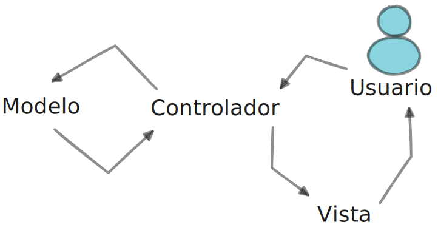

# Patrón MVC (Modelo, Vista y Controlador)
29_10_2023

El patrón MVC tiene varias versiones y formas de implementarse, **yo** en un principio me declino por la que voy a explicar.

Empiezo de nuevo.

El patrón MVC, es un patrón arquitectónico que separa un componente en tres partes: Vista, Modelo y Controlador, cada una con su objetivo y responsabilidad única.

* La vista se encarga de la parte visual de un componente que seria mostrar la información al usuario, generalmente eso es todo.

* El modelo se encarga de los datos que maneja un componente, tanto de guardarlos y recuperarlos como de establecer las *entidades* relacionadas a ellos.

* El controlador tiene la parte más activa, funcionando como un intermediario usuario / aplicación. 

	El controlador contiene los *eventos* necesarios para recoger las interacciones del usuario, puede llamar al modelo para actualizar y/o pedir la información que el usuario quiere para después adaptar dicha información y que la vista pueda mostrarla al usuario. Ya que el controlador se sitúa en medio generalmente nunca llegan a conocerse las demás partes, son tímidas y por ende están desacopladas.

> El patrón MVC tiene tres partes: Los datos, los precentadores de datos y un intermediario que controla cuando y como se precentan los datos.

## Ventajas y desventajas del patrón MVC

Como **ventajas** podemos ver una clara separación de responsabilidades, además gracias a este desacoplamiento es posible tanto tener varias vistas para un mismo modelo como facilitar la creación de pruebas unitarias.

Como **desventajas** están la curva de aprendizaje para aprender a implementar este patrón que puede ser un poco pesada, además de esto a veces cuesta respetar lo que impone el patrón, terminamos no implementándolo de la forma acordada, por ejemplo comunicando directamente al modelo con la vista para ""agilizar las cosas"" y tardar menos tiempo.

## La forma correcta de implementar el patrón MVC

Respuesta corta, no existe. Podemos tomar como base esta separación de tres componentes y adaptarla al contexto y alcance de la aplicación que desarrollamos, puede que necesitemos tanto agregar como cambiar la forma en que estos componentes se relacionan. 

**No te precipites**, antes de dar rienda suelta a tu imaginación estudia las variantes que ya existen las cuales posiblemente solucionen tu problema. Las más conocidas son: MVVM (Modelo-Vista-modelo de vista), MVP (Modelo-Vista-Presentador), MVT (Modelo-Vista-Template) y MVW (Modelo-Vista y lo que sea).

Para tomar decisiones primero entiende que aplicación estás creando, cuál es su fin y alcance, no es lo mismo un proyecto personal mediano que una aplicación de compras para una tienda de ropa o un sistema de contabilidad para una empresa multinacional, entender que es lo que estás creando te ayuda a tomar decisiones más precisas ¿Como entender? Pregunta, pregunta para entender, no hagas suposiciones.

Conceptos y principios como la separación de asuntos, ETC (Facilidad de cambio), ortogonalidad, cohesión y acoplamiento te ayudan a tomar decisiones al igual que conocer el lenguaje o tecnología que estás usando, hay algunos que se ajustan mejor que otros debido a sus características.

///
https://platzi.com/tutoriales/1248-pro-arquitectura/5466-que-es-el-patron-mvc/
https://www.freecodecamp.org/espanol/news/el-modelo-de-arquitectura-view-controller-pattern/
https://developer.mozilla.org/es/docs/Glossary/MVC
https://desarrolloweb.com/articulos/que-es-mvc.html
https://desarrolloweb.com/articulos/discusiones-aplicar-mvc-correctamente.html
///