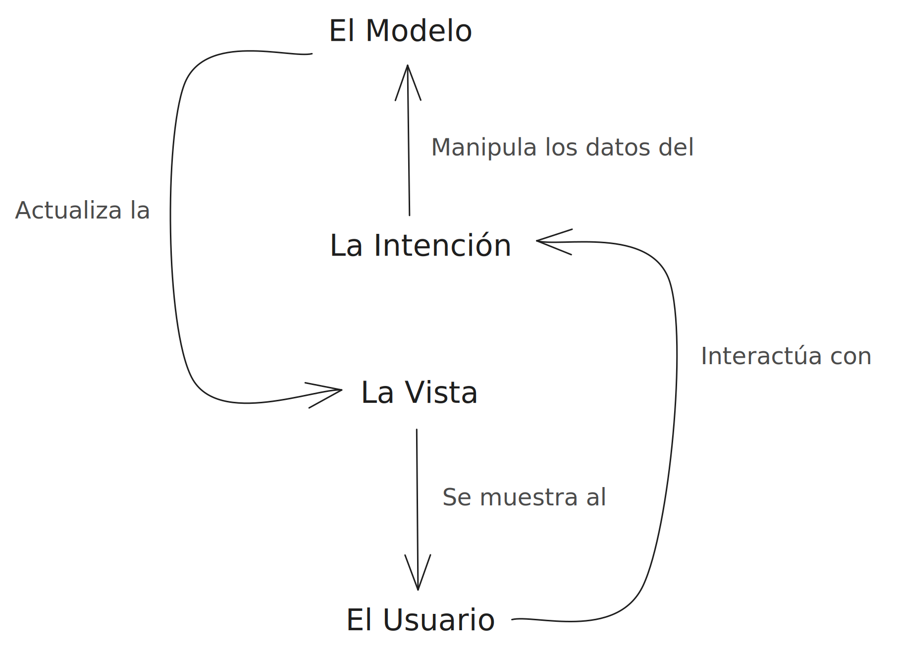
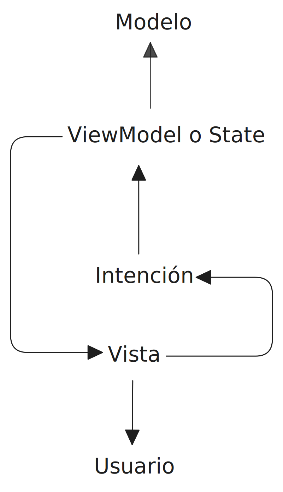

# Patrón Model-View-Intent (MVI)
05_26_2025

Este patrón arquitectónico ademas de proveernos una forma de organizar la presentación de los datos y las interacción del usuario, también busca ofrecer una solución para manejar un flujos de datos asíncronos (No secuenciales, con tiempos de espera para respuestas). 

> Este patrón esta dentro de la programación reactiva la cual se basa en los patrones de diseño _Observer_ e _Interator_.

El flujo seguido en resumen es el siguiente y se puede separar en dos partes:

1. El **Modelo** define como son los datos y estos datos son entregados a la **Vista** quien los muestra al usuario.

2. Cuando el usuario hace una interacción esta es recibida por la **Vista** y enviada/recibida **Intencion** la cual crea nuevos datos que remplazarán a los datos actuales, por último para finalizar el ciclo la **Vista** se actualizaría mostrando los nuevos datos. Este segundo flujo puede cambiar dependiendo de la implementación.

Veamos en detalle cada elemento:

* El Modelo (Model) es un objeto único en el sistema que define cuales y como son los datos que se mostraran o usara el usuario.

* El Estado (State) o *ViewModel* es quien almacena los datos definidos por el modelo. El estado es inmutable, por ende no debería ser posible modificarlo directamente, en su lugar se debería crear nuevos datos los cuales remplazaran a los actuales.

* La Vista (View) unicamente se encarga de mostrar el modelo de los datos.

* Una Intención (Intent) permite gestionar o traducir una interacción producida en la vista, al producirse dicha interacción la intención puede crear nuevos datos basándose en la interacción recibida. 

El determinismo es un concepto muy importante a la hora de implementar este patron ya que establece que la misma acción con el mismo estado inicial debería dar el mismo resultado. Buscamos que la información fluya en una sola dirección en una secuencia clara y trasparente de eventos.

///
https://thenewstack.io/developers-need-know-mvi-model-view-intent/
https://hackernoon.com/lang/es/esta-pequena-biblioteca-de-kotlin-podria-ser-la-forma-mas-limpia-de-construir-aplicaciones-cross-platform
https://ichi.pro/es/patron-de-arquitectura-reactiva-de-android-mvi-128530942790279
https://dev.to/josegermanx/flux-manteniendo-el-control-del-flujo-en-el-cambio-de-un-estado-react-5ckn
https://devexpert.io/mvi-android/
///