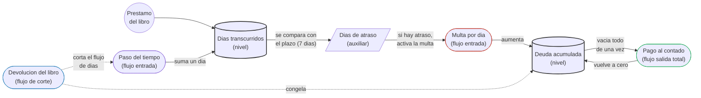

# Sistemas
00_00_2026

La base teorica del analisis sistemico es la teoria general de sistemas, la cual establece que un sistema es un conjunto de elementos relacionados que trabajan juntos para lograr un objetivo común. 

La sinergia hace referencia a que el resultado conjunto de los elementos relacionados es distinto a lo que cada elemento podria lograr por separado, es decir, la union y la interaccion entre las partes genera un valor que ninguna de ellas posee de forma individual.

El contexto, por su parte, es el entorno que rodea al sistema y con el cual este intercambia recursos, informacion o energia; ningun sistema existe de forma aislada, sino que se ve influenciado por su entorno y a la vez influye sobre el, por lo que comprender el contexto es tan importante como comprender los elementos internos.

Por ultimo, la retroalimentacion es el mecanismo por el cual la salida de un sistema vuelve a ingresar a el como una nueva entrada, permitiendole ajustar su comportamiento en funcion de sus propios resultados.

## Análisis sistémico

Cuando analizamos un problema en busca de una solución existen dos tipos de pensamientos: el tradicional y el sistémico.

El pensamiento tradicional busca la causa directa del problema y encuentra a un único responsable, un elemento aislado. Este enfoque puede no llegar al origen del problema e incluso puede empeorara la situación, ya que reacciona ante el problema sin invertir tiempo en comprenderlo, es un parche o una solución desconsiderada.

En cambio el pensamiento sistémico entiende el problema como un sistema, un conjunto de elementos relacionados. Donde la solución a largo plazo contiene varios cambios y ajustes no solo sobre los elementos sino también sobre sus relaciones. Podríamos encontrar un punto de partida para este análisis en el pensamiento tradicional, primero buscamos un elemento que parece central para luego identificar los elementos a su alrededor que lo influyen o con los cuales se relaciona. 

Por ejemplo el siguiente problema: en un supermercado cuando se acaba un producto se tarda mucho tiempo en reponer su stock. El pensamiento tradicional diría que el culpable es el gerente el cual no esta atento al stock, mientras que el pensamiento sistémico buscaría ver el cuadro completo ¿Porque el encargado tarda en hacer los pedidos? ¿Cuanto tiempo tardan en llegar los pedidos? ¿Como se realiza el seguimiento del stock? ¿Que otras tareas debe realizar el gerente? o incluso ¿Debe el gerente realizar el pedido? Todas estas preguntas nos revelan elementos, relaciones y diferentes factores que juntos conforman un sistema, y al comprenderlo podemos idear una solución.

## Modelos

Los modelos son representaciones intencionadas de un sistema donde nos enfocamos en lo importante según nuestro objetivo, permitiéndonos entender sus características y su estructura, por ejemplo, el mapa de una ciudad, es un modelo que muestra calles y algunos lugares destacados que nos sirven de referencia para nuestro objetivo, que es "orientarnos" y pasa por alto por ejemplo todos los locales y puestos de comida, información que solo es relevante si el mapa fuera uno gastronomico o turistico. 

Un modelo puede ser estático cuando muestra al sistema congelado en el tiempo o dinámico cuando muestra la evolución de este a traves del tiempo.  La naturaleza de un modelo puede ser conceptual o formal: los conceptuales buscan comunicar y explorar ideas, ayudandonos a representan la realidad para comprenderla, en cambio, los modelos formales dejan de ser ideas y pasan a ser echos, son representaciones matemáticas basadas en datos, esto permite ejecutarlos, realizar simulaciones y experimentar para evaluar su comportamiento y evolución.

## Ciclos causales

La realimentacion dentro de un sistema sucede cuando la salida del sistema vuelve a entrar al sistema permitiendo realizar ajustes en su funcionamiento interno para producir una mejor salida. En lugar de pensar en una relación lineal donde A causa B, la realimentación nos obliga a pensar en círculo: A causa B, B causa C, y C vuelve a influir sobre A, retroalimentando el proceso. Este retorno de la salida hacia la entrada es lo que le permite a un sistema autorregularse.

Los procesos de realimentacion pueden ser modelados mediante diagramas causales o diagramas de influencias que nos permiten analisar un sistema en base a las relaciones e influencias de sus elementos. Todo el enfasis se coloca en como se relacionan los elementos y los efectos que causan estas relaciones.

Existen dos ciclos basicos de realimentacion, los negativos y los positivos. Dentro de un sistema los ciclos de realimentacion negativa lo estabilizan ante perturbaciones externas reaccionando y anulando dicha perturbacion, por otro lado los ciclos de realimentacion positiva lo desestabilizan propagando y reforzando pertubaciones externas, generando un crecimiento o una caida cada vez mas pronunciados sin un punto de equilibrio natural, salvo que algo externo lo frene. Es importante aclarar que los terminos "negativo" y "positivo" hacen referencia a la reaccion ante una perturbacion, anularla o amplificarla.

En los sistemas complejos rara vez encontramos un unico ciclo actuando de forma aislada, sino que conviven varios ciclos positivos y negativos compitiendo entre si, y es precisamente esta combinacion la que determina el comportamiento general del sistema a lo largo del tiempo.

Estos ciclos son acompañados de tres tipos de variables, las de nivel, las de flujo y las auxiliares, que trabajan en conjunto para dar forma al comportamiento del sistema. 

Las variables de nivel acumulan valores a lo largo del tiempo, representando el estado del sistema en un momento dado y solo pueden modificarse a traves de las variables de flujo, las cuales determinan su comportamiento a traves de reglas, condiciones permiten definir cuanto entra o sale de una variable de nivel. Por ultimo, las variables auxiliares sirven como paso intermedio entre flujos y niveles, permitiendonos representar calculos o condiciones intermedias que influyen sobre el flujo.

Convinando estos conceptos (ciclos y variables) podemos definir sistemas complejos e identificar arquetipos sistemicos que nos permiten modelar y comprender sistemas a nivel conceptual.

Pensemos en una biblioteca: pedís prestado un libro, te dan un plazo, digamos 7 dias. Cuando retirás el libro, empieza a correr una cuenta de dias transcurridos (variable de nivel, arranca en cero y acumula dias transcurridos). Esa cuenta de dias se compara todo el tiempo contra el plazo permitido (7 dias), esta comparacion es una variable auxiliar, un calculo intermedio que nos dice si todavia estás en fecha o si ya te pasaste.

Cuando los dias transcurridos superan el plazo permitido, la variable auxiliar empieza a marcar dias de atraso y una variable de flujo activa la acumulacion de deuda (variable de nivel). Al devolver el libro se corta el flujo que generaba nuevos dias de atraso, pero la deuda ya acumulada no desaparece sola y es en el momento del pago donde el sistema termina de encontrar su equilibrio definitivo. Sin embargo, la forma en que se realiza ese pago determina a que tipo de equilibrio llega el sistema.

Si el pago se hace al contado, es decir, si cancelamos toda la deuda acumulada de una sola vez, una unica variable de flujo de salida vacia por completo la variable de nivel en un solo movimiento. La deuda vuelve a cero de forma inmediata, y el sistema regresa exactamente al mismo estado del que partio antes de retirar el libro. Este es un ciclo de balance fuerte, que actua de una sola vez con la magnitud justa y necesaria para anular por completo la perturbacion, devolviendo al sistema a su punto de partida original.

## Dinamica de sistemas

Jay Forrester, un ingeniero, se da cuenta que la estructura impulsa al comportamiento y que la realimentacion moldea los resultados de un sistema, partiendo de esta base desarrolla la dinamica de sistemas que analiza como las relaciones dentro de un sistema permiten explicar su comportamiento.

Los diagramas de Forrester nos permiten modelar un ciclo causal en dos niveles complementarios. A nivel conceptual, mediante diagramas completos y a nivel formal traduciendo los mismos elementos en formulas matematicas que describen con precision los procesos del sistema, cada flujo pasa a ser una ecuacion y cada variable auxiliar se convierte en un calculo intermedio que depende de otras variables del modelo.

Esta traduccion de lo conceptual a lo formal no es un simple ejercicio matematico, sino que es justamente lo que nos da la posibilidad de programar simulaciones, es decir, de ejecutar el modelo a lo largo del tiempo en una computadora para visualizar el comportamiento y la evolucion del sistema. Gracias a esto podemos, por ejemplo, poner a prueba distintos escenarios modificando los valores iniciales o las reglas del modelo. 

La dinamica de sistemas funciona como un puente entre la comprension cualitativa de un sistema y su comportamiento cuantitativo, permitiendonos pasar de una idea general sobre como funcionan las cosas a un modelo que podemos ejecutar, medir y ajustar.

///
Apuntes personales sobre "Introducción al Análisis Sistémico" - Tecnicatura Universitaria en Programación Fullstack - Universidad Provincial de Córdoba.
Delgado Gutiérrez, J. A. (2005). El análisis sistémico y su proyección multidisciplinar. Encuentros multidisciplinares. https://repositorio.uam.es/server/api/core/bitstreams/9d19f658-d618-4fa4-873d-c7ea73ef331e/content
///

