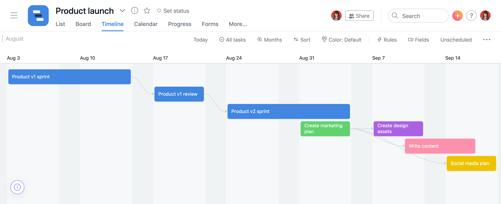
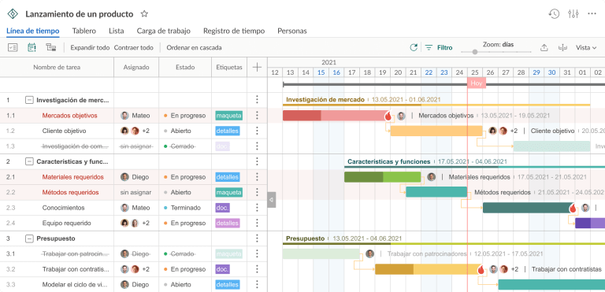

# Diagrama de Gantt
00_02_2025

El diagrama de Gantt nos permite organizar las tareas y plazos que deben seguir los miembros de un equipo para llevar a cabo un proyecto, es una forma de hacer más amigable el cronograma de tareas para un equipo chico de 5 u 8 miembros.

Dos elementos importantes en este diagrama ademas de las tareas son las dependencias y los hitos:

* Las Dependencias que nos indican que una tarea depende de que otra este terminada para llevarse a cabo, por ejemplo: La tarea "Hornear pan" depende de la tarea "Amasar pan".

* Los Hitos, fechas importantes para el proyecto como una visita de revision por parte del cliente, desplegar a producción una aplicación o el fin de la campaña de marketing.

## Creación del diagrama

1. Definir el plazo del proyecto, cuando inicia y *aproximadamente* cuando debería estar terminado.

2. Agregar tareas con sus respectivos plazos (Cuando deberían empezar y terminar).

3. Definir que tareas dependen de otras para comenzarse y los hitos del proyecto.

4. Realizar las modificaciones y ajustes necesarios cuando sea necesario a medida que avance el proyecto, como cambiar los plazos que no fueron realistas en su estimación al igual que definir o eliminar dependencias.

## Ejemplo de diagramas

Hay varias formas de hacer este diagrama, pero todas muestran gráficamente las tareas y sus plazos:

En este ejemplo las tareas son los rectángulos y su longitud indica el plazo. Si creamos un proyecto en GitHub esta seria la vista llamada "Roadmap".

Y en este otro ejemplo donde se muestra más información las tareas están a la izquierda y su plazo se muestra a la derecha.

## Ventajas

* Permite gestionar tareas y planificar los tiempos lo cual nos permite visualizar fácilmente el cronograma, el progreso e identificar "tiempos muertos" que se pueden aprovechar.

* Nos brinda control sobre las fechas y seguimiento de los avances.

## Desventajas

* Puede dar muchas complicaciones en proyectos muy grandes con largos plazos de tiempo (2 o 3 años), y si bien podríamos dividir el proyecto en sub proyectos mas chicos esto también podría dar complicaciones. 

* Este diagrama sigue un modelo en cascada, donde una cosa se lleva a cabo después de otra, esta rigidez podría dar complicaciones en algunos proyectos que necesiten menos rigidez en cuanto a los plazos de tiempo.

* Requiere ajustes constantes, esto podría o no considerarse una desventaja.

///
https://asana.com/es/resources/gantt-chart-basics
https://blog.ganttpro.com/es/guia-completa-para-los-diagramas-de-gantt/
https://www.leanmanufacturingweb.com/diagrama-de-gantt/
https://github.blog/changelog/2023-03-23-roadmaps-in-projects-are-now-generally-available/
///