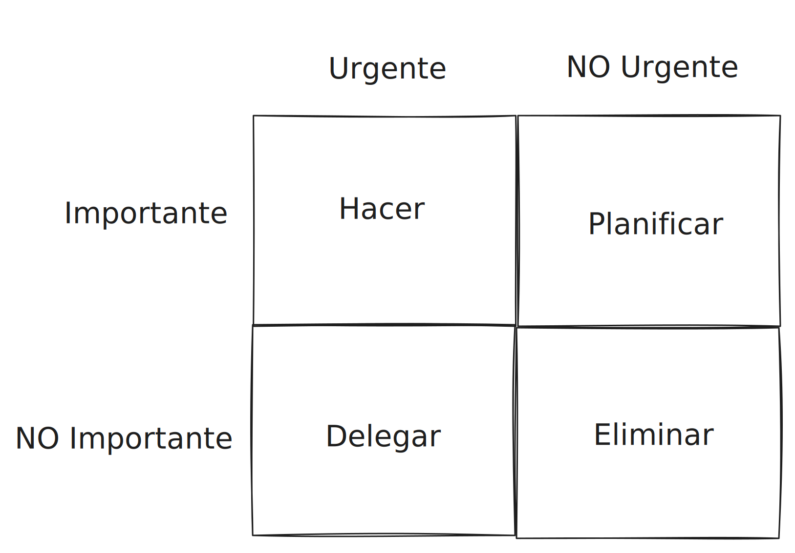

# Matriz de gestión del tiempo
00_06_2025

Esta matriz también conocida como *La matriz de Eisenhower* nos permite priorizar tareas orientando nuestro tiempo y esfuerzo hacia un objetivo. Para priorizar tareas con este método lo hacemos según dos variables _la urgencia_ y _la importancia_ las cueles crean 4 categorías que definen el tiempo y esfuerzo a dedicar:

1. Urgente e Importante (Hacer): Estas tareas tienen un impacto directo en el objetivo definido y ademas tienen una fecha limite inminente, la cual de no cumplirse tiene consecuencias claras sobre el proyecto. Estas tareas no pueden evitarse y su demora conlleva estrés y agotamiento.

2. Importante (Planificar): Las tareas importantes son aquellas que tienen un impacto significativo y contribuyen al objetivo definido, sin embargo no tienen una fecha limite definida. Es importante planificar su realización y definir una fecha limite estimada ya que al descuidar estas tareas se convierten en "Importantes y urgentes" lo cual deberíamos evitar. 

> Las dos primeras categorías aportan valor a largo plazo, mientras que las segundas pueden ser importantes para otras personas ajenas al objetivo definido.

3. Urgente (Delegar): Las tareas urgentes requieren atención, pero no debemos invertir mucho tiempo o recursos en su realización debido a que no son importantes, por este motivo es recomendable delegarlas. Este tipo de tareas son necesarias, ya que de aplazarse o no realizarse podrían interferir con el objetivo definido.

4. Ninguna (Eliminar): Las tareas que no son ni importantes ni urgentes deben eliminarse si es posible, sin embargo en su defecto si es posible llevarlas a cabo rápido y con poco esfuerzo deben hacerse o delegarse.

Podemos visualizar esta matriz de la siguiente forma:

O también podemos hacerlo de forma lineal:

///

///