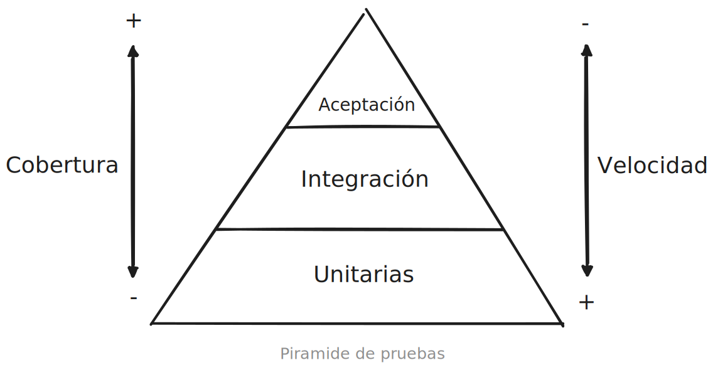

# Testing
00_00_2024

El testing mientras creamos una aplicación nos permite comprobar que sus diferentes partes funcionan como esperamos.

El funcionamiento de una aplicación siempre es probado ya sea por nosotros (los programadores) o por los usuario, teniendo esto en cuenta podemos: 

1. Probar primero y/o hacer TDD.

2. Probar durante y hacer un ping pong entre el código y las pruebas.

3. Probar después = **No probar nunca**.

Parece claro que deberíamos hacer algún tipo de prueba, porque solo sabemos si algo funciona cuando lo usamos. Las pruebas que hagamos deberían ser preferentemente automáticas porque son claras y pueden repetirse exactamente de la misma manera millones de veces, pero por mas que se llamen "automaticas" necesitan mantenimiento, eso no hay que olvidarlo.

Todo esto nos puede llevar a otro punto importante: El *Test Coverage* [Cobertura de pruebas].

¿Cuanta cobertura debería tener un aplicación? La cobertura de pruebas no debería ser una métrica fundamental mientras creamos una aplicación, aún así se recomienda que está métrica no baje sea cuál sea su valor.

## Feedback loop y la pirámide de pruebas

¿Que es el *feedback*? Podríamos decir que el feedback es una respuesta a una pregunta.

¿Que es el *feedback loop*? El ciclo de feedback es lo que se crea al tener pruebas automáticas, por ejemplo, si tenemos una prueba para una función podríamos escribir un poco de código y ejecutar las pruebas, si están en rojo y dicen que el código no hace lo que debería, entonces podríamos modificar el código y volvemos a ejecutar las pruebas. Eso es el *feedback loop*.

Ahora bien, existen diferentes tipos de pruebas automáticas cada una con diferentes características y atributos, la idea de "La pirámide de pruebas" es ilustrar que cantidad de cada tipo de prueba debería tener una aplicación.

Partiendo de la base, una aplicación debería tener muchos *unit test* [Pruebas unitarias] que prueban porciones pequeñas de código como una clase, método o función; A las pruebas unitarias le siguen varias pruebas de integración que prueban la integración de nuestra aplicación con alguna entidad externa como un repositorio de alguna base de datos; Por último al tope de la pirámide hay algunas pruebas de aceptación que prueban de la manera más realista posible la interacción del usuario con alguna característica importante de nuestra aplicación.

## Anti patrones al crear pruebas

No todas las pruebas aportan valor, hay cosas que no merece la pena probar, por eso siempre que escribas una prueba pregúntate ¿Que valor me aporta esta prueba?

### Pruebas anémicas o redundantes

Las pruebas anémicas son pruebas que no aportan valor, por ejemplo una prueba a un método *getter*, este tipo de métodos solo devuelve un valor por ende no hay ningún tipo de lógica u comportamiento digno ser probado. 

### Pruebas frágiles

Las pruebas frágiles son pruebas que saben demasiado, y se rompen al más mínimo cambio.

### Pruebas mentirosas

Las pruebas mentirosas en ingles llamadas *untrustest* son pruebas que aparentan aportar valor cuando en realidad no lo hacen, este tipo de pruebas no son muy comunes y pasan desapercibidas ya que son pruebas que no avisan si algo se rompe, pero pereciera que si lo hacen.

### Invertir la pirámide de pruebas

Al invertir la pirámide de pruebas la rapidez con la que recibimos feedback se vuelve demasiada lenta, y tener pruebas pierde todo el sentido, las pruebas empiezan a pesar en vez de ayudarnos.

## Las pruebas de las pruebas

Cuando las pruebas ya estén es verde y creemos que todo esta bien, podemos hacer *Mutation testing*, una practica que consiste en cambiar operadores dentro el código con el fin de ver si las pruebas detectan estos errores que introducimos y cumplen su objetivo de avisar que algo anda mal.

Ejemplo:

1. Primero que nada tenemos un código que funciona y una prueba en verde.

2. Introducimos un "mutante", por ejemplo cambiamos un <= por un <. 

3. Ejecutamos nuevamente las pruebas, si las pruebas estan en rojo este "mutante" que introdujimos fue capturado, por el contrario si las pruebas siguen en verde el "mutante" sobrevivio.

Esta practica hacer mutaciones dentro del código puede hacerce manualmente o instalando alguna libreria especifica.

## ¿Beneficios?

El testing nos permite comprobar que todo funciona como esperamos. Más allá de esta definición hay otras razones y puntos de vista sobre porque escribir pruebas y cuando hacerlo, ten en cuenta que cada opinión tiene un trasfondo y un contexto al igual que influye la experiencia que tiene la persona o el equipo.

> El testing es una forma efectiva de mostrar la presencia de errores, pero es una forma inadecuada de mostrar la ausencia de los mismos. - Dijkstra.

¿ ?

Las pruebas tienen la capacidad de decirnos que hay un error solo si hayamos pensamos que ese error podría existir y hayamos creamos una prueba que nos avise, aún asi siempre surgen nuevos errores en los que no pensamos, y cuando esto pese, lo mejor es crear una prueba para que no se nos vuelva a pasar por alto.

> Me pagan por programar, no por escribir pruebas. - Kent Beck

¿Cuales son los beneficios de escribir pruebas **automáticas**? Los beneficios que se obtienen o buscan al escribir pruebas pueden varias un poco dependiendo del proyecto o del equipo.

Nos aseguran que el código funciona, lo cual es fundamental al hacer cambios.

* Nos aseguran que no dejan de funcionar cosas que antes funcionaban, nos aseguran que las cosa funcionan de la misma forma que lo hacían antes.

* Nos aseguran que no repetimos errores que ya corregimos.

* Nos aseguran que la hacer cambios no dañamos la lógica de negocios.

Nos permiten escribir mejor código, las pruebas cambias nuestra forma de programar y resolver un problema porque empezamos a mirar al código desde fuera, esto pasa sobre todo con las pruebas unitarias.

* Si escribimos pruebas antes que el código estas nos obligan a pensar a fondo en el problema y su abstracción.

* Las pruebas nos permiten mejorar el diseño interno sin preocupaciones, recordemos que el código no se escribe bien a la primera.

Nos permiten expresar el comportamiento esperado, las pruebas son una forma de documentar que era lo que esperábamos de cierta parte de nuestra aplicación.

* Escribir pruebas nos permite dejar asentado como debería funcionar X porción de código o comportamiento.

Por último, las pruebas nos ahorran tiempo al depurar y enter código.

///

///